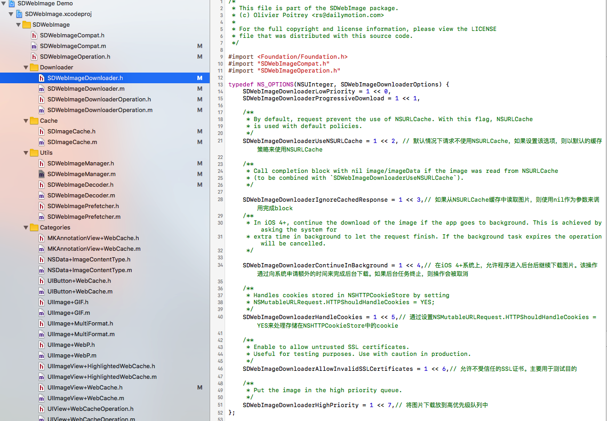

# SDWebImage-Source-Analyse
SDWebImage的源码分析实录

* SDWebImageCompat 缩放操作
* SDWebImageOperation 图片下载操作的基础协议
* SDWebImageDownloader 下载管理类
* SDWebImageDownloaderOperation 下载处理
* SDImageCache 缓存
* SDWebImageManager 图片操作管理类
* SDWebImageDecoder 解压缩
* UIImageView+WebCache 常用方法类